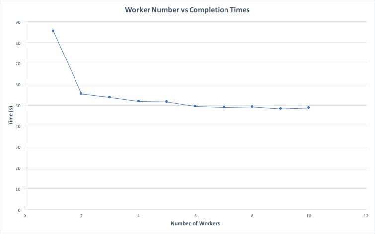

# Argon Cyclomatic Complexity Project

## Introduction

This project is focused on the efficient computation of code complexity for a given repository, cycling through every  commit in the repo, utilising a set of nodes as appropriate to minimise execution time from submission to result return.

## Implementation

I used the [CloudHaskell](https://bitbucket.org/esjmb/use-cloudhaskell) and [Argon](https://github.com/rubik/argon) libraries to distribute the work among worker nodes and to compute the cyclomatic complexities of each .hs file for each commit in the given repository.

To obtain the repository’s working folder, I send a command to clone the repo into my own folder (remove it then once the work is completed). I then recursively crawl through the folder and obtain the absolute file path for ALL files in the repo directory and then filter the list of files for only .hs files because they are all that [Argon](https://github.com/rubik/argon) works on.

Once these are obtained I send these file paths to the workers to get the complexities and return the results and repeat for every commit in the repo.

## Running

1. Clone this repo `git clone https://craig1901/complexity_api`
2. `stack build` inside the directory
3. `bash workers.sh` to create the workers (you can open this file to add more or use less)
4. `bash run.sh <repo to compute clyclomatic complexity>`
5. View your results!

## Results

For results on this project, I collected the time it took to complete the computation of the cyclomatic complexities for all commits for a given repo

Results based on this [Repository](https://github.com/craig1901/chatServer/):

### Table

| # of Workers | Time (s) |
| ------------- | --------- |
| 1 | 85.32 |
| 2 | 55.42 |
| 3 | 53.62 |
| 4 | 51.81 |
| 5 | 51.47 |
| 6 | 49.53 |
| 7 | 48.93 |
| 8 | 49.09 |
| 9 | 48.33 |
| 10 | 48.73 |

### Graph

